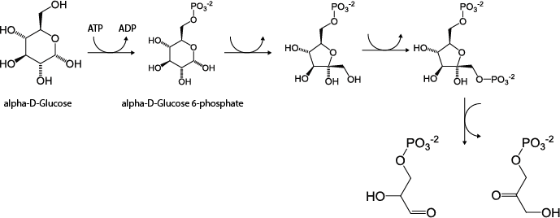

```{r setup, include=FALSE}
knitr::opts_chunk$set(collapse = TRUE, dev = "png", fig.width = 7, fig.height = 5, message = FALSE, warning = FALSE)
```
## Introduction to MINVAL
The **MINVAL** package was designed as a tool to identify orphan metabolites and evaluate the mass and charge balance of stoichometric reactions. MINVAL also includes functions to write models in TSV and SBML formats, extract all reactants, products, metabolite names and compartments from a metabolic reconstruction.



## Syntax and Mass-Charge Evaluation
```{r message=FALSE}
library("minval")
library("sybilSBML")
```

```{r}
glycolysis <- read.csv2(system.file("extdata", "glycolysisKEGG.csv", package = "minval"),
                        stringsAsFactors = FALSE)
```
```{r}
colnames(glycolysis)
```

```{r}
glycolysis$REACTION
```

```{r}
isValidSyntax(reactionList = glycolysis$REACTION)
```

```{r}
glycolysis$REACTION[2]
glycolysis$REACTION[2] <- "D-Glyceraldehyde 3-phosphate[c] <=> 3 Glycerone phosphate[c]"
```

```{r}
glycolysis$REACTION[6]
glycolysis$REACTION[6] <- "2-Phospho-D-glycerate[c] <=> 3-Phospho-D-glycerate[c]"
```
```{r}
isValidSyntax(reactionList = glycolysis$REACTION)
```

```{r}
chemicalData <- read.csv2(system.file("extdata", "chemData.csv", package = "minval"))
```
```{r}
isBalanced(reactionList = glycolysis$REACTION,referenceData = chemicalData,ids = "NAME",mFormula = "FORMULA")
```
```{r}
glycolysis$REACTION[2]
glycolysis$REACTION[2] <- "D-Glyceraldehyde 3-phosphate[c] <=> Glycerone phosphate[c]"
```
```{r}
glycolysis$REACTION[8]
glycolysis$REACTION[8] <- "alpha-D-Glucose 6-phosphate[c] <=> beta-D-Fructose 6-phosphate[c]"
```
```{r}
isBalanced(reactionList = glycolysis$REACTION,referenceData = chemicalData,ids = "NAME",mFormula = "FORMULA")
```
```{r}
glycolysis <- addExchangeReactions(glycolysis)
convert2sbml(glycolysis,"glycolysis.sbml")
```
```{r,warning=FALSE,message=FALSE}
glycolysis <- readSBMLmod("glycolysis.sbml")
glycolysis
```
```{r}
lowbnd(glycolysis)[glycolysis@react_id=="EX_alpha_D_Glucose(c)"] <- -1
```
```{r}
optimizeProb(glycolysis)
```